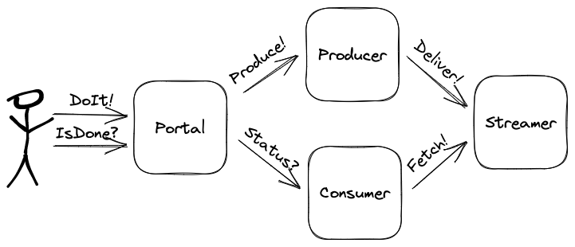

# kafkloud
Kafka Roundtrip Acquisition and Processing Platform (KRAPP)

## Description

Project to get experience with and demonstrate implementation and
cloud deployment of a service suite involving data flow through Kafka,
supporting multiple producers and consumers, with a feedback loop.

## Repository

The project is organized into a "monorepo" in which all necessary components
are self-contained.

## Technologies

The initiative should use as many of the target technologies as plausible:

- Frontend (`ReactJS`, `Tailwind`, `Jupyter`)
- Programming Languages (`Typescript`, `Go`, `Python`)
- Middleware (`Kubernetes`, `Docker`, `NextJS`, `ExpressJS`, `gorilla/mux`)
- Backend (`Kafka`)
- Cloud Deployment (`GCP`, `Terraform`)

## Requirements

As of this writing, the clearest "business use case" that is in hand focuses
on "getting experience with" and "demonstrating" the use of the target technologies
identified above.

## Design

Normally, projects start with a _functional_ requirement and work towards a design
that meets those.  However, the design here is motivated by finding _some_ reasonable
functional requirements to meet the _experiential_ requirements at hand; that is,
a design that has _some_ relevance to systems providing real value (e.g., for data
processing), but mostly to give an opportunity to use & practice the targeted
technologies.

The idea that "won" the search for functional requirements is for a data processing
platform that uses Kafka as its "backbone" for communicating events or messages
between other components, similar to what is fashionable these days for such a
[popular paradigm](http://www.jpaulmorrison.com/fbp/).  One of the non-functional benefits expected from such a design
is re-use and extensibility: I can only hope that additional (perhaps more valuable :blush:)
use cases might be able to leverage this framework in the future.

### First Use Case


_(diagram created with [excalidraw](https://excalidraw.com/))_

Keeping it simple, the first delivery milestone will demonstrate flow of
information across several components; the following components / endpoints
will facilitate demonstration of meeting this goal:

#### Component: `portal`
- `DoIt` - UI button triggering a call to `producer` resulting in a message being sent to `streamer`
- `IsDone` - UI control or display informing user of the status of processing of the message

#### Component: `producer`
- `/produce` - HTTP `POST` endpoint triggering creation and delivery of message(s) to `streamer`

#### Component: `streamer`
- Standard Kafka APIs are used the inbound and outbound endpoint(s) for `streamer`

#### Component: `consumer`
- `/status` - HTTP `GET` endpoint retrieving the evidence of `producer` message(s)

## Implementation

An envisioned implementation satisfying the goals outlined above comprises three
independent deployment components:

- A front-end `portal` to operate / control the stack
- A `producer` to generate messages into `streamer` that uses `Kafka`
- A `consumer` to process data supplied by the `streamer`

Summary notes are below, and are augmented in [docs](docs).

The components of `kafkloud` are described below.

### `portal`

The primary functional concern of `portal` is to provide the main user interface 
for the `kafkloud` stack.  

To satisfy the goal of gaining more experience with [React](https://react.dev/)
and [Typescript](https://www.typescriptlang.org/), the front-end service can be created
with them.  And, because of its newness and popularity, the [NextJS](https://nextjs.org/)
framework could be a good one to leverage with both `React` and `Typescript`.

> #### _May 3rd Update: Accessing `portal`_
>
> The `portal` application deployed in `Kubernetes` can be accessed at
> [http://localhost:30080](http://localhost:30080) through "port forwarding", e.g.:
>
> ```shell
> $ kubectl port-forward -n kafkloud $(kubectl get pods -n kafkloud -l component=portal --no-headers -o jsonpath='{.items[0].metadata.name}') 30080:3000
> ```

### `producer`

The primary concern of `producer` is to send events / messages (e.g., as a "data stream")
into `streamer`.

To favor gaining additional experience using `NodeJS` in a back-end context,
this will be built using `ExpressJS` and `Typescript`.

### `streamer` 

The primary concern of `streamer` is to accept data (e.g., representing "events" or
other types of "messages") on one end, and make them available to one or more
consumer(s) on the other end.

To gain experience packaging, deploying, and using `Kafka`, `streamer` will be
implemented in as much of a "standalone" deployment of `Kafka` as is practical.

> #### _May 3rd Update: Accessing the `kafkaui` Dashboard_
> The open-source `kafkaui` is used as a "dashboard" for accessing
> `streamer`'s Kafka service.  When running in `Kubernetes`, its user
> interface can be accessed at [http://localhost:30060](http://localhost:30060)
> by using "Port Forwarding" as illustrated in the example below:
> ```shell
> $ kubectl port-forward -n kafkloud $(kubectl get pods -n kafkloud -l app=kafkaui --no-headers -o jsonpath='{.items[0].metadata.name}') 30080:3000
> ```

### `consumer` 
The primary concern of `consumer` is to read and process data from the stream.

To help maintain familiarity with it, `golang` was chosen to implement this service.

### `seer` 
The `seer` component will "learn" from the content of messages it receives from `streamer`
enabling it to answer related questions via its API layer, available to `portal`.

`seer` is implemented in `Python`.

## Deployment

In order to satisfy the requirements of cloud deployment within Kubernetes, and
to facilitate local testing, the components will be packaged into Docker images
that can be referenced in Kubernetes manifests for both local and cloud deployment
environments (e.g., Docker Desktop, Minikube, GCP/GKE or AWS/EKS, ...)

### Workflow

Development and deployment workflows are generally supported by `Makefile` targets,
defined in the main folder and within each of the (component) subprojects.
These workflows support building and deployment of the components into local,
Docker and Kubernetes environments.  Many of the `Makefile` targets have a `-new-`
variant which performs the indicated step after performing all the prior steps in
the workflow first - i.e., it's like performing a "fresh build."

While targets in the top-level `Makefile` are used to orchestrate deployment into
a Kubernetes environment, additional targets in the component-level `Makefile`s
support deployment into local and Docker environments.

#### Local

Targets containing the name `local` are used to support the local (development) workflow:

- `update-local` - updates external dependencies
- `build-local` - builds the local deployment artifact(s) from the source
- `run-local` - runs the component using the (local) built deployment artifact(s)

#### Docker

- `build-image` - builds the Docker image(s) associated with the component
- `run-image` - runs the component(s) in the local Docker environment
- `push-image` - push the Docker image(s) to the configured repository

#### Kubernetes

- `apply-k8s` - apply the Kubernetes manifest(s) associated with the component
- `query-k8s` - query the status of the component(s) within the Kubernetes cluster
- `delete-k8s` - deletes the component(s) within the Kubernetes cluster 
- `attach-k8s` - initiates "port forwarding" enabling access from outside the cluster
- `recreate-k8s` - deletes, then re-creates the component(s) within the cluster 

### GCP

With a Google Kubernetes Environment (GKE) configured in the current context (e.g.
using `kubectl`), the [Kubernetes](#Kubernetes) workflow described above can be used
to deploy into GCP.  

For more details, see _[GCP Deployment Notes](docs/gcp-deployment.md)_.

### Networking

The back-end components of Kafkloud can talk to each other on a common VPC network.
In the `docker` deployments, a `bridge` network named `kafkloud-backend` is created
and used for this purpose.

The single, user-facing UI component of `portal` (i.e., the NextJS React browser
components) could conceivably access its single point of entry to the `portal`
back-end on a separate network; however, as of this writing, the same network
is used (e.g., `kafkloud-backend` in the Docker deployments).

#### Port Assignment

An attempt is made to standardize and catalog the network addresses of the
service across the supported deployment environments, as follows:

| Component  | Docker              | Kubernetes                     |
|------------|-------------------------|--------------------------------|
| `portal`   | `portal:3000`           | `portal-svc:3000`              |
| `consumer` | `consumer:8072`         | `consumer-svc:8072`            |
| `producer` | `producer:8000`         | `producer-svc:8000`            |
| `seer`     | `seer:8030`             | `seer-svc:8030`                |
| `seer`     | `chromadb:8020`         | `chromadb-svc:8020`            |
| `streamer`  | `broker:9092,9997,29092` | `broker-svc:9092,9997,29092`   |
| `streamer`  | `kafkaui:8060`          | `kafkaui-svc:8060`             |
| `streamer` | `zookeeper:2181,2888,3888`            | `zookeeper-svc:2181,2888,3888` |


## For Further Exploration

Some additional technologies and tools are identified as potentially helpful to
this project, and warrant further exploration:

- [Kubeshark](https://kubeshark.co/) - could be useful to help quickly triage issues with `Kubernetes` deployments
- [Kubernetes Management Dashboard](https://kubernetes.io/docs/tasks/access-application-cluster/web-ui-dashboard/) - _might_
  be preferable to using the `Kubernetes` CLIs in _some cases_ :sunglasses:
